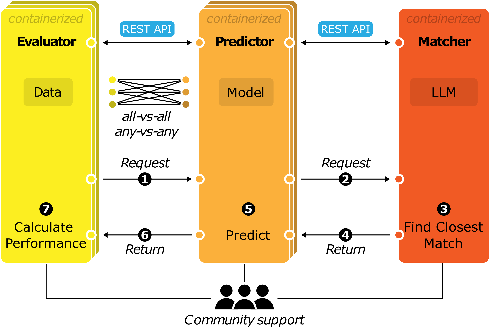
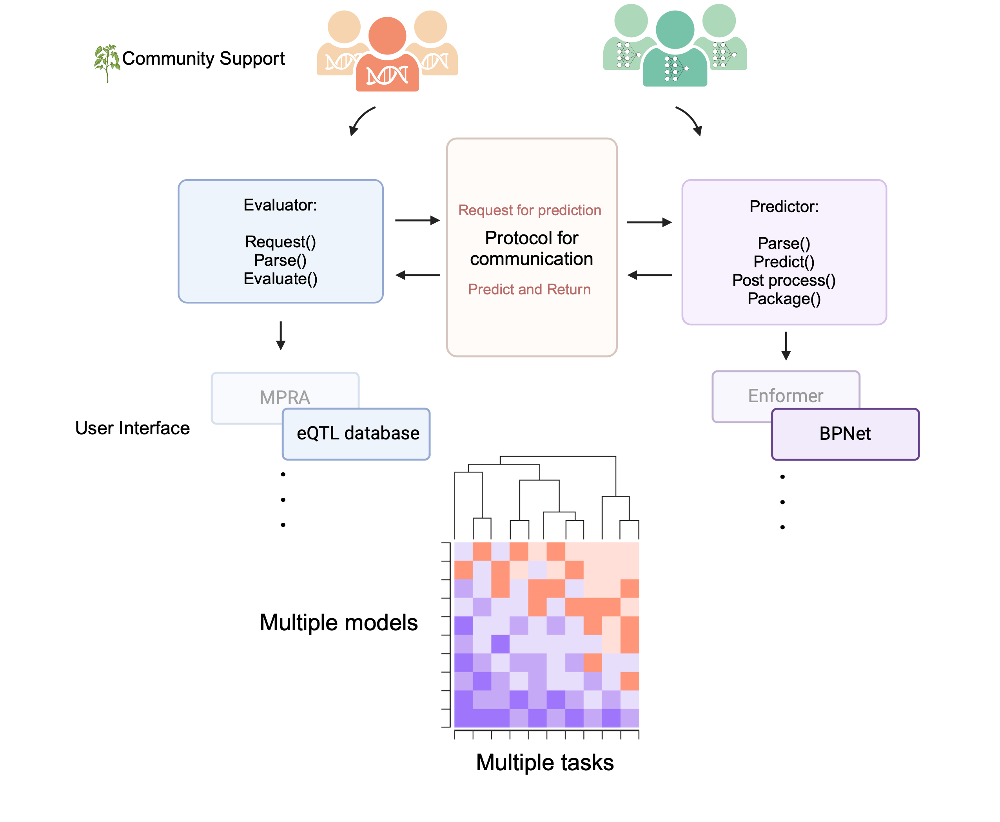

# Genomic API for Model Evaluation (GAME)

This repository introduces the GAME framework to enable standardized benchmarking of genomic models across various datasets.

## Links

- [ReadTheDocs](https://genomic-api-for-model-evaluation-documentation.readthedocs.io): GAME documentation
- [GAME Specs](https://genomic-api-for-model-evaluation-documentation.readthedocs.io/en/latest/API/index.html): API specifications from the documentation
- [GAME Modules Repo](https://github.com/de-Boer-Lab/GAME_modules): Community-contributed list of GAME modules
- [bioRxiv Preprint](https://www.biorxiv.org/content/10.1101/2025.07.04.663250v1): GAME: Genomic API for Model Evaluation (first submission)

## Brief Overview

GAME was designed for the functional genomics community to create seamless communication across pre-trained models and genomics datasets. It is a product of the feedback from many model and dataset experts and our hope is that it allows for long-lasting benchmarking of models. Models and datasets communicate via a set of predefined protocols through APIs. The common protocol enables any model to communicate with any dataset (although not all combinations may make sense).

The evaluators (dataset APIs) will make prediction requests in the standard format to the predictors (model APIs), which then return the predictions to the Evaluator in a standard format, enabling the evaluators to calculate the model’s performance. Each of the evaluators and predictors will be containerized using Apptainer.

For this effort to succeed we encourage data and model experts to provide us with feedback and support (via contributing Evalutors and Predictors). Since dataset creators are the experts in their dataset, they are most qualified to decide how these models should be evaluated on their data. Meanwhile, model creators are best qualified for deciding how the model should be used for the inference tasks. Accordingly, the responsibilities for adding the new datasets and models would fall on their creators. Being able to easily compare results across different datasets and models would accelerate the improvement of genomics models, motivate novel functional genomic benchmarks, and provide a more nuanced understanding of model abilities.

## Contributions

If you would like to be involved we encourage you to use this API with your own models and datasets and submit to the [Github repo list](https://github.com/de-Boer-Lab/GAME_modules).

### Points of contact

If you have critiques, questions, or feedback please feel free to reach out to Ishika Luthra (<ishika.luthra@ubc.ca>), Satyam Priyadarshi (<satyam.priyadarshi@ubc.ca>), or Carl de Boer (<carl.deboer@ubc.ca>).
